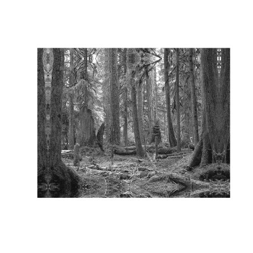

## Indexing, Cropping and Extending Images


```r
require(RCurl)
```

```
## Loading required package: RCurl Loading required package: bitops
```

```r
require(png)
```

```
## Loading required package: png
```

```r
require(COMP121)
```

```
## Loading required package: COMP121 Loading required package: jpeg Loading
## required package: markdown
```

```r
puppy <- readPNG(getURLContent("http://dtkaplan.github.io/ScientificComputing/Resources/Images/mindo.png"))
forest <- readPNG(getURLContent("http://i1006.photobucket.com/albums/af189/WarriorsLoverLittleHeart/Forest-1.png"))
```

# Frame function exercise

```r
revFrame <- function(imgPng, frameWidth) {
    red <- imgPng[, , 1]
    imgVector <- dim(imgPng)
    column <- imgVector[2]
    row <- imgVector[1]
    columnFrame <- cbind(red[, rev(1:frameWidth)], red, red[, rev((column - 
        frameWidth):column)])
    rowFrame <- rbind(columnFrame[rev(1:frameWidth), ], columnFrame, columnFrame[rev((row - 
        frameWidth):row), ])
    canvas(x = c(1, (2 * frameWidth) + column), y = c(1, (2 * frameWidth) + 
        row), asp = 1)
    rasterImage(rowFrame, 1, 1, (2 * frameWidth) + column, row + (2 * frameWidth))
}
```

# revFrame forest test 

```r
revFrame(forest, 40)
```

 

```r
revFrame(forest, 10)
```

 

```r
revFrame(forest, 100)
```

 


# more framing tasks

```r
# color frame
colorFrame <- function(imgPng, frameWidth = 0, neg = 0, RGBChange = c(1, 1, 
    1)) {
    red <- imgPng[, , 1]
    green <- imgPng[, , 2]
    blue <- imgPng[, , 3]
    imgVector <- dim(imgPng)
    column <- imgVector[2]
    row <- imgVector[1]
    columnFrameRed <- cbind(red[, rev(1:frameWidth)], red, red[, rev((column - 
        frameWidth):column)])
    frameRed <- rbind(columnFrameRed[rev(1:frameWidth), ], columnFrameRed, columnFrameRed[rev((row - 
        frameWidth):row), ])
    columnFrameGreen <- cbind(green[, rev(1:frameWidth)], green, green[, rev((column - 
        frameWidth):column)])
    frameGreen <- rbind(columnFrameGreen[rev(1:frameWidth), ], columnFrameGreen, 
        columnFrameGreen[rev((row - frameWidth):row), ])
    columnFrameBlue <- cbind(blue[, rev(1:frameWidth)], blue, blue[, rev((column - 
        frameWidth):column)])
    frameBlue <- rbind(columnFrameBlue[rev(1:frameWidth), ], columnFrameBlue, 
        columnFrameBlue[rev((row - frameWidth):row), ])
    canvas(x = c(1, (2 * frameWidth) + column), y = c(1, (2 * frameWidth) + 
        row), asp = 1)
    if (neg == 1) {
        colorFrame <- 1 - array(c(frameRed, frameGreen, frameBlue), dim = c(dim(frameRed), 
            3))
    }
    if (neg == 0) {
        colorFrame <- array(c(frameRed, frameGreen, frameBlue), dim = c(dim(frameRed), 
            3))
    }
    redChange = RGBChange[1]
    greenChange = RGBChange[2]
    blueChange = RGBChange[3]
    colorFrame[, , 1] <- redChange * colorFrame[, , 1]
    colorFrame[, , 2] <- greenChange * colorFrame[, , 2]
    colorFrame[, , 3] <- blueChange * colorFrame[, , 3]
    rasterImage(colorFrame, 1, 1, (2 * frameWidth) + column, row + (2 * frameWidth))
    return(dim(colorFrame))
}
colorFrame(forest, 80)
```

 

```
## [1] 641 801   3
```

```r
colorFrame(forest, 80, 1)
```

 

```
## [1] 641 801   3
```

```r
colorFrame(forest, 80, , c(0.9, 1, 1))
```

 

```
## [1] 641 801   3
```

```r
colorFrame(forest, 80, , c(1, 0.5, 1))
```

 

```
## [1] 641 801   3
```

```r
colorFrame(forest, 80, , c(1, 1, 0.5))
```

 

```
## [1] 641 801   3
```

